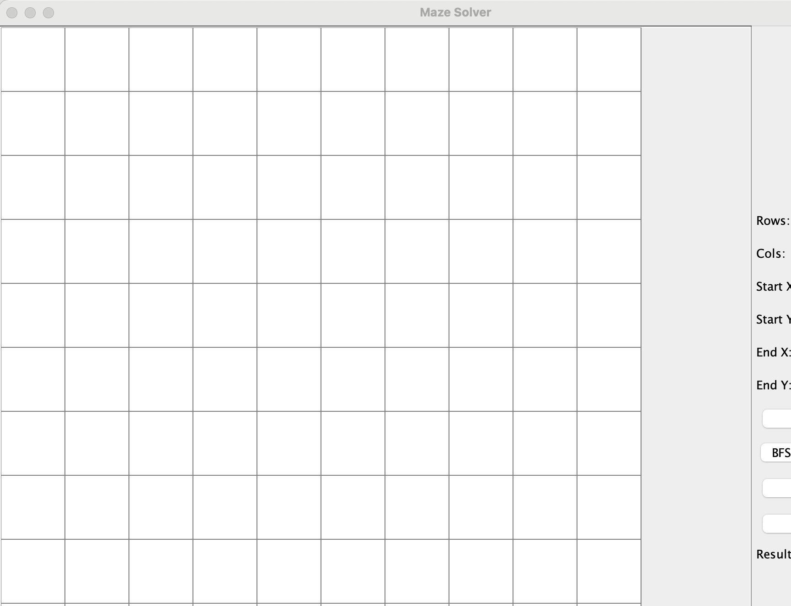
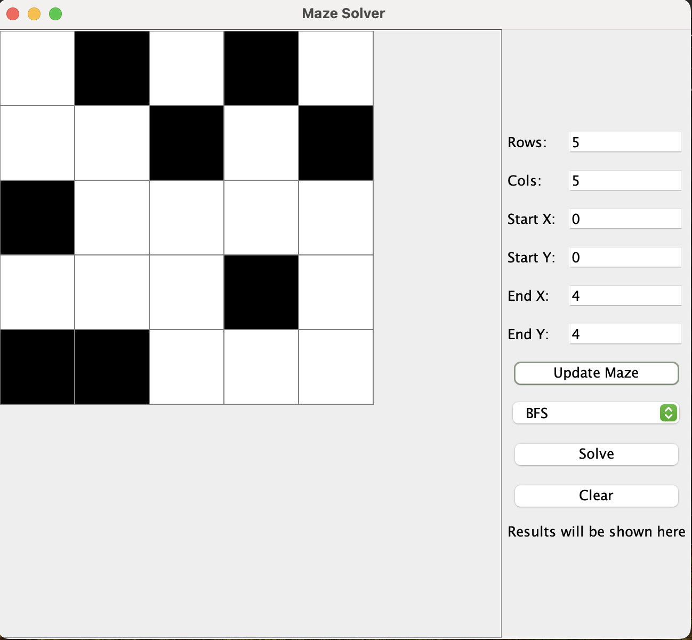
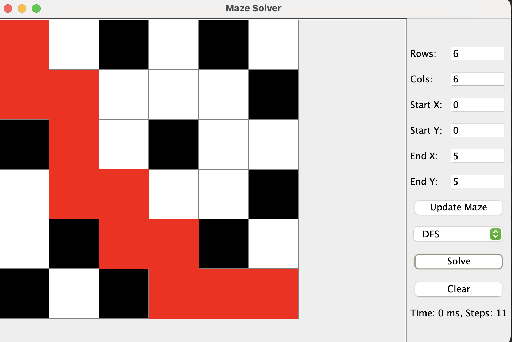
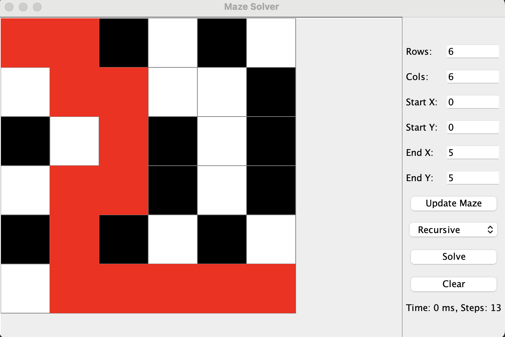

# Proyecto Final

- **Carrera:** Computación.

- **Materia:** Estructura de Datos.
- **Fecha de entrega:** 29/7/2024.
- **Docente:** Ing.Pablo Torres.
- **Integrantes:**

  - Milton Chuqui _mchuquic2@est.ups.edu.ec_
  - John Serrano _jserranom2@est.ups.edu.ec_
  - Josué Valdez _jvaldezl1@est.ups.edu.ec_
#

## Descripcion del Problema

- El proyecto consiste en desarrollar una aplicación que implemente un algoritmo para encontrar la ruta óptima desde un punto de inicio (A)     hasta un punto de destino (B) en un laberinto. Utiliza conceptos avanzados de programación dinámica y estructuras de datos lineales y no lineales.
- El algoritmo debe ser capaz de encontrar la ruta más corta entre dos puntos en un laberinto, teniendo en cuenta las restricciones de
movimiento (puede moverse sólo hacia arriba, abajo, izquierda o derecha) y las restricciones de obstáculos (no puede moverse a través de paredes o espacios ocupados por otros objetos).

## Propuesta de solución

### Marco Teórico

- Programación Dinámica: Es una técnica de optimización que mejora la eficiencia mediante el almacenamiento de los resultados de subproblemas ya resueltos para evitar cálculos redundantes.
- BFS (Breadth-First Search): Es un algoritmo de búsqueda en grafos que explora los vecinos de un nodo antes de avanzar a los siguientes niveles.
- DFS (Depth-First Search): Es un algoritmo de búsqueda en grafos que explora tan profundo como sea posible antes de retroceder.

### Descripción de la solución

- _Algoritmos implementados:_

  - Método Recursivo Simple.

  - Método Aplicando Cache (Programación Dinámica).
  - BFS.
  - DFS.

- **Estructuras de Datos:** Utilizamos estructuras adecuadas para representar el laberinto y almacenar las rutas.
- **Patrón MVC:** La organización del código sigue el patrón de diseño Modelo-Vista-Controlador (MVC) para una separación clara de responsabilidades.
- **Interfaz de Usuario:** Diseñamos una interfaz simple que permite la entrada del laberinto y visualiza la ruta óptima.

### Capturas
- Interfaz

- BFS

- DFS

- Recursivo

## Conclusión

- _En la implementación de los diferentes métodos, se observaron
  los siguientes resultados:_

  - **Método Recursivo:** Es eficiente, pero puede no ser óptimo para laberintos grandes debido a su complejidad y uso de memoria.

  - **Programación Dinámica:** Mejora la eficiencia al evitar redundancias, almacenando resultados intermedios.
  - **BFS:** Se puede considerar que este es el método mas eficiente (Búsqueda de choque) comparado con los demás siendo asi que este sirve para encontrar el camino mas corto y más rápido ya que encuentra el camino mas corto entre dos nodos.
  - **DFS:** Puede ser más rápido en algunos casos pero no garantiza la ruta más corta tambien requiere un espacio de memoria proporcional a la profundidad del grafo en el peor de los casos, lo cual puede ser un limitante en grafos muy profundos.

- **Conclusión final:** Entre los métodos evaluados, BFS demostró ser la opción más eficiente para encontrar el camino más corto en el contexto del problema planteado.

#

## Consideraciones

- _Milton Chuqui:_ Falto mejorar la resolucion del laberinto haceiendo que los métodos BFS y DFS pinten todos los caminos posibles haya o no haya caminos para llegar al destino. 

- _John Serrano:_Falto mejorar la interfaz, me hubiera gustado poder poner imaganes en el camino correcto, para que sea mas dinamico y vistoso para el usuario. 

- _Josue Valdez:_ Falto implementar una mejora en parte de organizar el codigo se crearon muchas clases e instancias que hacian que no ejecute bien el codigo y daba errores casi todo el tiempo.

#
